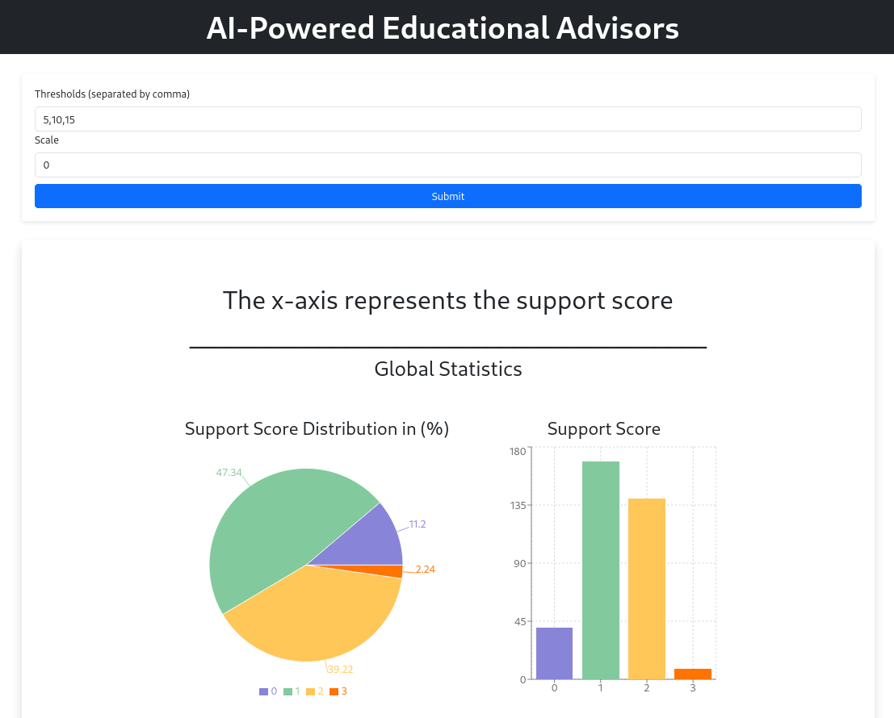
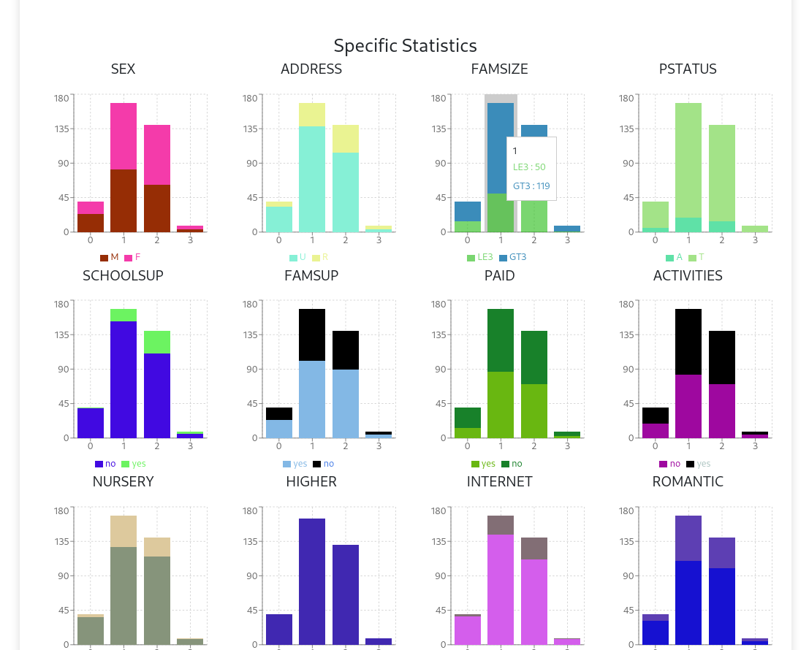
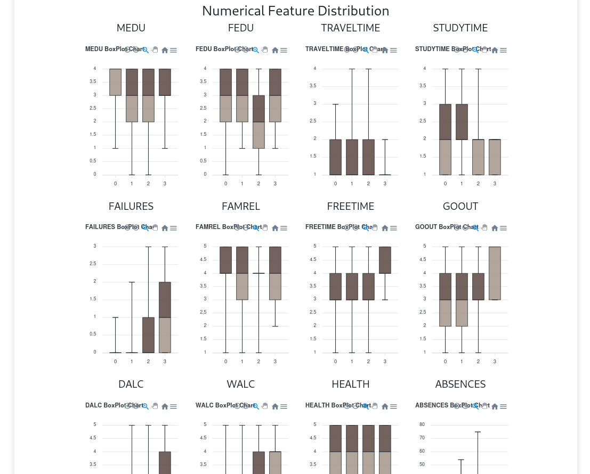

# AI-Powered Educational Advisors

This tool allows the input of grade thresholds to define different levels of support need, with corresponding support scores assigned to each level.

The dashboard facilitates visualization of various statistics and incorporates an intelligent tool powered by artificial intelligence to define scores and levels effectively.

# Backend Link

This Front is developed using React working in Vite.  
The backend is developed using FastApi:  
[Backend Link:](https://github.com/hocinilotfi/back) <https://github.com/hocinilotfi/back>  

@hocinilotfi  
<hocini.lotfi@gmail.com>

# Screenshoots

